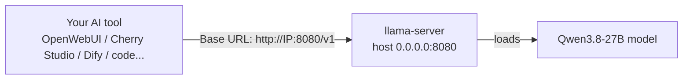

One-click deployment of **Qwen3.8-27B** on a single RTX 3090 (24GB) **on Windows 11**: Q4_K_XL quantization + MTP speculative decoding + 96K context window, exposed as an **OpenAI-compatible** `llama-server`, averaging ~**47 tok/s** with ~**1.5×** lossless MTP speedup.

在单张 RTX 3090（24GB）上 **一键部署 Qwen3.8-27B**（**Windows 11 部署实测**）：Q4_K_XL 量化 + MTP 推测解码 + 96K 上下文，以 **OpenAI 兼容** `llama-server` 对外服务，平均 ~**47 tok/s**，MTP 无损提速 ~**1.5×**。

---

## Hardware & System Requirements / 硬件与系统要求

| Item / 项目 | Requirement / 要求 |
|------|------|
| GPU | NVIDIA RTX 3090 (24GB); other 24GB cards also work, but less VRAM will OOM / NVIDIA RTX 3090（24GB）；其他 24GB 卡也可，但显存更小会 OOM |
| VRAM / 显存 | ≥ 24GB (Q4_K_XL weights ~17.6GB + KV cache + MTP + CUDA overhead, totaling ~23GB) / ≥ 24GB（Q4_K_XL 权重 ~17.6GB + KV cache + MTP + CUDA 开销，合计约 23GB） |
| OS / 系统 | Windows 10/11 64-bit / Windows 10/11 64 位 |
| Driver / 驱动 | NVIDIA driver ≥ 550 (required by the CUDA 12.4 build) / NVIDIA 驱动 ≥ 550（CUDA 12.4 构建需要） |
| Disk / 磁盘 | ~**20GB** free for model + binaries (first download) / 模型 + 二进制约 **20GB** 可用空间（首次下载） |
| Runtime / 运行时 | PowerShell 5.1+ (built-in); `curl` ships with the system or the script / PowerShell 5.1+（系统自带）；`curl` 随系统或脚本自带 |

> Text-only model — no network needed for inference (only the first download needs network / proxy).
> 纯文本模型，无需联网即可推理（仅首次下载需要网络 / 代理）。

---

## Directory Structure / 目录结构

```
llama-3090/
├── deploy_and_run.bat      # one-click entry: double-click to deploy + launch (downloads on first run, skips afterward) / 一键入口：双击即部署+启动（首次下载，之后跳过）
├── qwen38_deploy.ps1       # actual deploy logic (download + launch) / 实际部署逻辑（下载 + 启动）
├── start_server.bat        # launch only, no download (daily restart once model is ready) / 仅启动，不含下载（模型已就绪时日常复启用）
├── gen_api_key.ps1         # sk-* API key generator (main script) / sk-* API key 生成器（主脚本）
├── gen_api_key.bat         # double-click entry for key generator / key 生成器双击入口
├── api_keys.txt            # API key list (used by llama-server auth, one per line; created by generator) / API key 列表（llama-server 鉴权用，每行一个；用生成器创建）
├── Qwen3.8-27B-UD-Q4_K_XL.gguf   # main model ~17.6GB (generated after first download) / 主模型 ~17.6GB（首次下载后生成）
├── mtp-Qwen3.8-27B-Q4_0.gguf     # MTP draft head ~1.68GB (generated after first download) / MTP 草稿头 ~1.68GB（首次下载后生成）
└── llama.cpp/              # llama.cpp CUDA build (includes llama-server.exe and CUDA runtime DLLs) / llama.cpp CUDA 构建（含 llama-server.exe 与 CUDA 运行时 DLL）
```

> Note: the first run also generates `llama.cpp.tmp/` (a temp dir for download/unzip); normally the script cleans it up automatically. If it is left behind after an abnormal exit, you can delete it manually — it does not affect operation.
> 注：首次运行后还会生成 `llama.cpp.tmp/`（下载解压临时目录），正常情况下脚本会自动清理；若异常退出残留，可手动删除，不影响运行。

---

## Quick Start / 快速开始


### First-time Deployment (download + launch) / 首次部署（下载 + 启动）

Double-click `deploy_and_run.bat`; the script will, in order:

双击 `deploy_and_run.bat`，脚本会依次：

1. Download the latest llama.cpp CUDA build (including the cudart runtime DLL) and merge it into `llama.cpp/`;
2. Download the model GGUF (~17.6GB, resumable);
3. Download the MTP draft head;
4. Launch `llama-server`, listening on `0.0.0.0:8080` (reachable on the LAN).

1. 下载最新 llama.cpp CUDA 构建（含 cudart 运行时 DLL）并合并到 `llama.cpp/`；
2. 下载模型 GGUF（~17.6GB，断点续传）；
3. 下载 MTP 草稿头；
4. 启动 `llama-server`，监听 `0.0.0.0:8080`（局域网可访问）。

> On first launch, if `api_keys.txt` does not yet exist, it will show "no auth" and run normally; after generating a key with `gen_api_key.bat` and restarting, auth is enabled (see "API Key Authentication").
> 首次启动时若还没有 `api_keys.txt`，会提示「无鉴权」并照常运行；用 `gen_api_key.bat` 生成 key 后重启即可开启鉴权（见「API Key 鉴权」）。

> The first download is large — please be patient (for users in China, enabling a proxy is recommended; see "Network / Proxy" below). If the download is interrupted, just re-run the script to resume; already-downloaded parts are skipped automatically.
> 首次下载较大，请耐心等待（国内建议开启代理，见下文「网络 / 代理」）。下载中断重跑脚本即可续传，已下载部分自动跳过。

### Daily Restart (after download done) / 日常复启（已下载完成）

Use the standalone launch script to skip all download logic:

直接用独立的启动脚本，跳过所有下载逻辑：

```
start_server.bat                 # normal launch (96K context) / 正常启动（96K 上下文）
start_server.bat -Vision         # multimodal (swap to a VL model first, see below) / 多模态（需先换 VL 模型，见下文）
start_server.bat -Ctx 65536      # raise context to 64K (only if VRAM allows) / 改上下文到 64K（显存够才用）
start_server.bat -Port 8081      # change server port / 改服务端口
start_server.bat -ApiKeyFile C:\path\keys.txt   # use another key file (default api_keys.txt) / 换用其他 key 文件（默认 api_keys.txt）
```

> Auth is on by default: as long as `api_keys.txt` exists, `--api-key-file api_keys.txt` is added automatically; deleting the file disables auth (see "API Key Authentication").
> 鉴权默认开启：只要 `api_keys.txt` 存在就自动带 `--api-key-file api_keys.txt`；删除该文件即关闭鉴权（见「API Key 鉴权」）。

---

## What the Three Scripts Do / 三个脚本的作用

| Script / 脚本 | Purpose / 用途 | Includes download? / 是否含下载 |
|------|------|-----------|
| `deploy_and_run.bat` | one-click deploy entry, double-click; passes args through (`%*`) / 一键部署入口，双击用；参数透传（`%*`） | Yes / 是 |
| `qwen38_deploy.ps1` | core deploy logic: fetch build / model / MTP head and launch / 部署核心逻辑：拉取构建/模型/MTP 头并启动 | Yes / 是 |
| `start_server.bat` | launch service only, recursively locate exe, with all tuning params / 仅拉起服务，递归定位 exe、带全部调优参数 | No / 否 |

---

## Launch Parameters (script defaults) / 启动参数（脚本默认值）

The actual server command line (`reasoning_effort` is passed via an environment variable and is not shown in the command line):

服务实际命令行（`reasoning_effort` 经环境变量传入，不在命令行中显示）：

```
llama.cpp\llama-server.exe
  -m Qwen3.8-27B-UD-Q4_K_XL.gguf
  --alias qwen3.8-27b
  -c 98304
  --parallel 1
  -ngl 99
  -fa on
  --cache-type-k q8_0
  --cache-type-v q8_0
  --spec-type draft-mtp
  --spec-draft-model mtp-Qwen3.8-27B-Q4_0.gguf
  --api-key-file api_keys.txt        # auto-appended when api_keys.txt exists / 存在 api_keys.txt 时自动附加
  --host 0.0.0.0
  --port 8080

# env var (not in command line, but already in effect) / 环境变量（不在命令行里，但已生效）
LLAMA_ARG_CHAT_TEMPLATE_KWARGS={"reasoning_effort":"high"}
```

| Param / 参数 | Value / 值 | Purpose / 作用 |
|------|-----|------|
| `-m` | `Qwen3.8-27B-UD-Q4_K_XL.gguf` | main model (27B, Q4_K_XL, ~17.6GB) / 主模型（27B，Q4_K_XL，~17.6GB） |
| `--alias` | `qwen3.8-27b` | model short name (clients use this, not the long filename) / 模型短名（客户端填这个，不是长文件名） |
| `-c` | `98304` | context window upper bound 96K (loadable on 24GB in practice, tight headroom; independent of `reasoning_effort` tier) / 上下文窗口上限 96K（24GB 实测可加载，余量偏紧；与 `reasoning_effort` 档位无关） |
| `--parallel` | `1` | single concurrent session (VRAM only fits one) / 单并发（显存只够一个会话） |
| `-ngl` | `99` | offload all layers to GPU (avoid falling back to CPU) / 全量层 offload 到 GPU（避免掉回 CPU） |
| `-fa` | `on` | enable Flash Attention / 开启 Flash Attention |
| `--cache-type-k/v` | `q8_0` | KV cache quantization, saves VRAM and is faster / KV cache 量化，省显存且更快 |
| `--spec-type` | `draft-mtp` | MTP speculative decoding (~1.5× speedup, lossless) / MTP 推测解码（约 1.5× 提速，无损） |
| `--spec-draft-model` | `mtp-Qwen3.8-27B-Q4_0.gguf` | MTP draft model / MTP 草稿模型 |
| `--api-key-file` | `api_keys.txt` | auth key file (one per line, `#` = comment); omitted automatically with a warning if the file is missing / 鉴权 key 文件（每行一个，`#` 注释）；文件不存在时自动省略并告警 |
| `--host/--port` | `0.0.0.0:8080` | listen on all interfaces at 8080 (OpenAI-compatible API, reachable on LAN) / 监听所有网卡 8080（OpenAI 兼容 API，局域网可访问） |

---

## Configurable Options / 可配置项

Edit the top of `qwen38_deploy.ps1` (the top variables of `start_server.bat` work the same way):

编辑 `qwen38_deploy.ps1` 顶部（`start_server.bat` 顶部变量同理）：

| Variable / 变量 | Default / 默认值 | Description / 说明 |
|------|--------|------|
| `$MODEL_FILE` | `Qwen3.8-27B-UD-Q4_K_XL.gguf` | main model filename / 主模型文件名 |
| `$MTP_FILE` | `mtp-Qwen3.8-27B-Q4_0.gguf` | MTP draft head / MTP 草稿头 |
| `$CTX_SIZE` | `98304` | context window upper bound (default 96K, loadable on 24GB in practice, tight headroom); can be set to `65536`/`131072`, but 96K+MTP is ~23.6GB, near the limit — lower it if OOM (high tier uses more reasoning tokens, be conservative with large context) / 上下文窗口上限（默认 96K，24GB 实测可加载、余量偏紧）；可改 `65536`/`131072`，但 96K+MTP 时约 23.6GB 接近上限，OOM 就调小（high 档推理 token 更占预算，上大上下文更需保守） |
| `$REASONING` | `high` | `low`/`medium`/`high`/`xhigh`; default was xhigh which over-thinks / `low`/`medium`/`high`/`xhigh`；默认 xhigh 会过度思考 |
| `$PORT` | `8080` | server port / 服务端口 |
| `$API_KEY` | `""` (empty) | single inline key (`--api-key`); plaintext appears in script / process command line, local debugging only — use `$API_KEY_FILE` for daily use / 单个内联 key（`--api-key`）；明文会出现在脚本/进程命令行，仅本地调试用，日常用 `$API_KEY_FILE` |
| `$API_KEY_FILE` | `api_keys.txt` | key file (`--api-key-file`), higher priority than `$API_KEY`; auth is enabled only if the file exists, otherwise a warning is shown and it is skipped / key 文件（`--api-key-file`），优先级高于 `$API_KEY`；文件存在才启用鉴权，不存在则告警并跳过 |

### Want higher precision? / 想更高精度？

- **Q6_K (~21–22GB)**: quality between Q4/Q8, but 32K+KV+MTP is risky — lower `$CTX_SIZE` to 8K–16K. / **Q6_K（~21–22GB）**：质量介于 Q4/Q8 之间，但 32K+KV+MTP 会很悬，需把 `$CTX_SIZE` 砍到 8K–16K。
- **Running real Q8 (~27GB)**: impossible on a single 3090; needs 32GB VRAM (e.g. 5090), 48GB (e.g. A6000), or two 3090s in parallel. / **真跑 Q8（~27GB）**：单张 3090 无解，需 32GB 显存（如 5090）、48GB（如 A6000）或双 3090 并联。

---

## Maximum Context (context window upper bound) / 最长上下文（上下文窗口上限）


- **The current default context is 98304 tokens (96K)**, set by the launch flag `-c 98304`, and is **independent of the `reasoning_effort` tier** — none of the `low/medium/high/xhigh` tiers change the context ceiling; the high tier only changes the length of the reasoning chain (`reasoning_content`), not the context upper bound.
- **当前默认上下文为 98304 tokens（96K）**，由启动参数 `-c 98304` 决定，**与 `reasoning_effort` 档位无关**——`low/medium/high/xhigh` 四档都不会改变上下文天花板；high 档改变的只是推理链（`reasoning_content`）的长度，不是上下文上限。
- Evidence from measurement: startup log `n_ctx_slot = 98304`, and `/v1/models` returns `context_length = 98304`.
- 实测佐证：启动日志 `n_ctx_slot = 98304`，`/v1/models` 返回 `context_length = 98304`。
- ⚠️ **Note**: the high tier generates a longer reasoning chain, and these reasoning tokens **count within the 96K total budget**. So under the same total window, the high tier leaves slightly less room for actual conversation history than the low tier — but the **ceiling is always 98304**, and does not change with the tier.
- ⚠️ **注意**：high 档会生成更长的推理链，这部分 reasoning token **计入 96K 总预算内**。所以同样的总窗口下，high 档留给实际对话历史的空间比 low 档相对少一点——但**上限始终是 98304**，不随档位变化。

### Want larger / smaller context? / 想调大 / 调小上下文？

Change `$CTX_SIZE` (the top variable in both scripts) to `65536` / `98304` (current default) / `131072` and re-run; KV cache grows roughly linearly with context and uses more VRAM. If VRAM is tight, lower the default to `65536` or even `32768`.

改 `$CTX_SIZE`（两脚本顶部变量）为 `65536` / `98304`（当前默认）/ `131072`，重跑即可；KV cache 随上下文近似线性增长，更吃显存。显存吃紧就把默认调小到 `65536` 甚至 `32768`。

#### Four-tier measured usability (2026-08-20, current config: Q4_K_XL + MTP + high + ngl99 + fa on + cache q8_0) / 四档实测可用性（2026-08-20，当前配置：Q4_K_XL + MTP + high + ngl99 + fa on + cache q8_0）

> Test method: launch llama-server with `-c 32768 / 65536 / 98304 / 131072` in turn, check whether it can listen successfully (KV cache loads without error), and sample VRAM usage after load. In practice, specify via `start_server.bat -Ctx 65536`, etc.
> 测试方式：依次以 `-c 32768 / 65536 / 98304 / 131072` 启动 llama-server，判定能否成功监听（加载 KV cache 不报错），并采样加载后显存占用。实际使用以 `start_server.bat -Ctx 65536` 等方式指定。

| Context / 上下文 | `-c` | VRAM after load / 加载后显存占用 | 24GB remaining / 24GB 剩余 | Result / 结论 |
|--------|------|--------------|-----------|------|
| 32K | `32768` | ~22700 MiB | ~1900 MiB | ✅ usable, most stable, ample headroom / ✅ 可用，最稳，余量充足 |
| 64K | `65536` | 22756 MiB | ~1820 MiB | ✅ usable, ample headroom / ✅ 可用，余量充足 |
| 96K (default) / 96K（默认） | `98304` | 23848 MiB | ~728 MiB | ✅ usable, tight headroom / ✅ 可用，余量偏紧 |
| 128K | `131072` | 24199 MiB | ~377 MiB | ⚠️ loadable, but only ~377MB headroom — high risk in production / ⚠️ 可加载，但余量仅 ~377MB，实战高风险 |

- Under the current config, **measurement shows it can load up to 128K** (KV cache allocation passes, can listen), but 128K leaves only ~377MB — Flash Attention activation peaks / long-prompt inference easily trigger transient OOM, so it is only recommended for stress tests or short-output scenarios; **the default is 96K (headroom ~728MB, tight, watch out for long high-tier reasoning)**; if you want more stability and looser VRAM, set `$CTX_SIZE` back to `65536` or `32768`.
- **结论**：在当前配置下，**实测最大可加载到 128K**（KV cache 分配通过、能监听），但 128K 仅剩 ~377MB 余量，Flash Attention 激活值峰值 / 长 prompt 推理极易触发瞬时 OOM，仅建议压测或短输出场景尝试；**默认即 96K（余量 ~728MB，余量偏紧，high 档长推理需留意）**；若想更稳、显存更宽松，可把 `$CTX_SIZE` 调回 `65536` 或 `32768`。
- ⚠️ The table above shows usage at the "model load + KV allocation" stage, **excluding the activation peak during actual generation**. The high tier produces more reasoning tokens and uses more budget, so be conservative with large contexts; if OOM actually happens, lower it.
- ⚠️ 上表是「模型加载 + KV 分配」阶段的占用，**不含实际生成时的激活峰值**。high 档推理 token 更多、更占预算，上大上下文时务必保守，真 OOM 就往回调小。

---

## `reasoning_effort`: Four-tier Measured Audit / reasoning_effort 四档实测稽核（2026-08-20）

All four values of `$REASONING` **work normally**, verified by measurement (not just inferred from docs).

`$REASONING` 的四个取值 **均可正常使用**，已实测验证（非仅凭文档推断）。

**Method** / **方法**：On the running service (default `medium`), override `reasoning_effort` per request via the request body `chat_template_kwargs`, send 4 requests for the same "chicken-and-rabbit" reasoning problem, and observe whether errors occur and how the reasoning output differs.

在正在运行的服务（默认 `medium`）上，通过请求体 `chat_template_kwargs` 逐档覆盖 `reasoning_effort`，用同一道「鸡兔同笼」推理题发 4 次请求，观察是否报错及推理产出差异。

**Results** / **结果**：

| Value / 取值 | HTTP | Reasoning text length / 推理文本长度 | Key phenomenon / 关键现象 |
|------|------|------------|---------|
| `low` | 200 | 387 | normal step-by-step reasoning (Chinese) / 正常分步推理（中文） |
| `medium` | 200 | 257 | normal step-by-step reasoning (Chinese), default tier / 正常分步推理（中文），默认档 |
| `high` | 200 | 384 | reasoning shows English planning ("We need answer in Chinese..."), clearly deeper / 推理痕迹出现英文规划语（"We need answer in Chinese..."），深度明显加大 |
| `xhigh` | 200 | 426 | same as above, longest and most detailed reasoning / 同上，推理最长、最详尽 |

**Conclusion** / **结论**：

- All four tiers are accepted by the server and generate successfully, **no errors, no crashes**.
- 四档均被服务端接受、生成成功，**无报错、无崩溃**；
- Evidence of override taking effect: the `high`/`xhigh` tiers switch reasoning traces to English internal planning, showing the value really changes the model's reasoning depth rather than being ignored.
- 覆盖生效证据：`high`/`xhigh` 档推理痕迹切换为英文内部规划，说明值真实改变了模型推理深度，而非被忽略；
- Reasoning length is not strictly monotonic (here `medium` is slightly shorter than `low`), which is normal sampling variance and does not affect usability; to judge whether it takes effect, just check "no error + `reasoning_content` produced".
- 推理长度非严格单调（本例中 `medium` 略短于 `low`），属采样正常波动，不影响可用性；判断是否生效看「是否报错 + 是否产出 `reasoning_content`」即可；
- Two ways to take effect: ① startup default (`$REASONING` / env var `LLAMA_ARG_CHAT_TEMPLATE_KWARGS`); ② per-request temporary override via `chat_template_kwargs`.
- 生效途径有二：① 启动默认值（`$REASONING` / 环境变量 `LLAMA_ARG_CHAT_TEMPLATE_KWARGS`）；② 单次请求内用 `chat_template_kwargs` 临时覆盖。
- On 2026-08-20 the default tier was changed to `high` and verified by measurement: on the same reasoning problem, three requests "default / low / high" gave reasoning text lengths 364 / 256 / 374 — default (364) is almost identical to explicit high (374) and clearly longer than low (256), proving the server's default `high` env var really takes effect (note: even on simple problems a high tier only does minimal planning; length does not equal tier — look at relative differences).
- 2026-08-20 已将默认档改为 `high` 并实测确认生效：在同一道推理题上发「默认 / low / high」三请求，推理文本长度分别为 364 / 256 / 374——默认（364）与显式 high（374）几乎一致、且明显长于 low（256），证明服务端默认 `high` 环境变量确实生效（注：简单问题高挡也只做极简规划，长度不代表档位，看相对差异即可）。

---

## Vision / Multimodal Toggle / 视觉 / 多模态开关

Two ways to enable (choose one):

开启方式（二选一）：

- Edit `qwen38_deploy.ps1` and change `$ENABLE_VISION = $false` to `$true`;
- Or command line: `deploy_and_run.bat -Vision` / `start_server.bat -Vision`.

- 编辑 `qwen38_deploy.ps1`，把 `$ENABLE_VISION = $false` 改为 `$true`；
- 或命令行：`deploy_and_run.bat -Vision` / `start_server.bat -Vision`。

After enabling, it auto-downloads the vision projector file `mmproj-F16.gguf` and appends the `--mmproj` flag.

开启后会自动下载视觉投影文件 `mmproj-F16.gguf` 并附加 `--mmproj` 参数。

> ⚠️ **Important**: `--mmproj` only works on **vision models**. The current model is the text-only `Qwen3.8-27B`, so **even with the toggle on you cannot view images** — llama-server will report "model is not a vision model". To actually use vision you need to:
> 1. Change `$MODEL_FILE` to the corresponding **Qwen3.8-VL GGUF**;
> 2. Point `$MMPROJ_REPO` / `$MMPROJ_FILE` to that vision repo's projector file.
> ⚠️ **重要**：`--mmproj` 只对**视觉模型**有效。当前跑的是纯文本 `Qwen3.8-27B`，**即使开了开关也看不了图**——llama-server 会报“模型不是视觉模型”。要真正用上视觉，需：
> 1. 把 `$MODEL_FILE` 换成对应的 **Qwen3.8-VL GGUF**；
> 2. 把 `$MMPROJ_REPO` / `$MMPROJ_FILE` 指向该视觉仓库的投影文件。

---

## Network / Proxy / 网络 / 代理

The script has built-in proxy support, defaulting to `http://127.0.0.1:10808`:

脚本内置代理支持，默认走 `http://127.0.0.1:10808`：

- GitHub API passes `-Proxy` explicitly;
- `curl` downloads use the `HTTP_PROXY` / `HTTPS_PROXY` env vars (resumable with `--retry 3`).

- GitHub API 显式传 `-Proxy`；
- `curl` 下载走 `HTTP_PROXY` / `HTTPS_PROXY` 环境变量（断点续传 `--retry 3`）。

To change or disable it, edit `$PROXY` in `qwen38_deploy.ps1`:

如需修改或关闭，编辑 `qwen38_deploy.ps1` 的 `$PROXY`：

```powershell
$PROXY = "http://127.0.0.1:10808"   # set to "" to disable / 设为 "" 可禁用
```

GitHub CDN may be slow/intermittent; the script uses `curl -C -` for resumable download — just re-run if interrupted.

GitHub CDN 可能慢/断，脚本用 `curl -C -` 支持断点续传，断了重跑即可。

---

## API Usage Examples (OpenAI compatible) / API 使用示例（OpenAI 兼容）

The service listens on `0.0.0.0:8080`: locally use `http://127.0.0.1:8080` or `http://localhost:8080`; other devices on the LAN use `http://<host IP>:8080` (find `<host IP>` with `ipconfig`). It is OpenAI-compatible.

服务监听 `0.0.0.0:8080`：本机可用 `http://127.0.0.1:8080` 或 `http://localhost:8080`；局域网其他设备用 `http://<本机IP>:8080`（`<本机IP>` 用 `ipconfig` 查）。兼容 OpenAI 接口。

> ⚠️ Auth is on by default (see "API Key Authentication"): every request must carry `Authorization: Bearer <some key from api_keys.txt>`, otherwise it returns **401**. In the examples below, replace `sk-xxxxxxxx` with the actual key.
> ⚠️ 鉴权默认开启（见「API Key 鉴权」）：所有请求都要带 `Authorization: Bearer <api_keys.txt 里的某个 key>`，否则返回 **401**。下面示例把 `sk-xxxxxxxx` 换成实际 key。

List loaded models:

查看已加载模型：

```bash
curl http://127.0.0.1:8080/v1/models -H "Authorization: Bearer sk-xxxxxxxx"
```

Chat completion:

对话补全：

```bash
curl http://127.0.0.1:8080/v1/chat/completions \
  -H "Content-Type: application/json" \
  -H "Authorization: Bearer sk-xxxxxxxx" \
  -d '{
    "model": "qwen3.8-27b",
    "messages": [{"role": "user", "content": "用一句话介绍你自己"}],
    "max_tokens": 200,
    "temperature": 0.7
  }'
```

> A response containing the `reasoning_content` field means `reasoning_effort` is in effect. Clients (e.g. OpenWebUI, Cherry Studio) just fill the base URL as `http://<host IP>:8080/v1` (see "Connect AI Agents / Clients" below).
> 返回中带 `reasoning_content` 字段，说明 `reasoning_effort` 已生效。客户端（如 OpenWebUI、Cherry Studio）base URL 填 `http://<本机IP>:8080/v1` 即可（见下文「接入 AI Agent / 客户端」）。

---

## API Key Authentication (on by default) / API Key 鉴权（默认开启）

The service enables API Key auth by default: as long as `api_keys.txt` exists in the same directory as the launch script, llama-server starts with `--api-key-file api_keys.txt`, and all `/v1/*` requests must carry `Authorization: Bearer <key>`, otherwise it returns **401 Unauthorized**.

服务默认启用 API Key 鉴权：只要启动脚本同目录存在 `api_keys.txt`，llama-server 就会以 `--api-key-file api_keys.txt` 启动，所有 `/v1/*` 请求都必须带 `Authorization: Bearer <key>`，否则返回 **401 Unauthorized**。

### Generate key / 生成 key

Double-click `gen_api_key.bat` (or `.\gen_api_key.ps1`):

双击 `gen_api_key.bat`（或 `.\gen_api_key.ps1`）：

- Each run generates 1 random `sk-` key (cryptographically random, 32 bytes / 64 hex chars) and **appends** it to `api_keys.txt`, auto-deduplicating against existing keys;
- Batch: `.\gen_api_key.ps1 -Count 3`; print only without writing: `.\gen_api_key.ps1 -NoAppend`; specify file: `.\gen_api_key.ps1 -OutFile keys.txt`.

- 每次生成 1 个 `sk-` 开头的随机 key（加密级随机，32 字节/64 位 hex）并**追加**到 `api_keys.txt`，自动读已有 key 去重；
- 批量：`.\gen_api_key.ps1 -Count 3`；只打印不写文件：`.\gen_api_key.ps1 -NoAppend`；指定文件：`.\gen_api_key.ps1 -OutFile keys.txt`。

### How it takes effect / 生效方式

1. After generating a key, **restart the service** (llama-server only reads the key file at startup);
2. In the client (OpenWebUI / Cherry Studio / DSH / code, etc.), fill any key from `api_keys.txt` into the API Key field;
3. Multiple keys supported: one per line in the file (`#` starts a comment); any key works.

1. 生成 key 后**重启服务**（llama-server 只在启动时读取 key 文件）；
2. 客户端（OpenWebUI / Cherry Studio / DSH / 代码等）的 API Key 栏填 `api_keys.txt` 里任意一个 key；
3. 支持多 key：文件里每行一个（`#` 开头为注释），任一 key 均可通过。

### Disable / change key / 关闭 / 换 key

- **Disable auth**: delete `api_keys.txt`; or launch with `start_server.bat -ApiKeyFile ""` (ps1 sets `$API_KEY_FILE` empty);
- **Change key file**: `start_server.bat -ApiKeyFile C:\path\keys.txt` (ps1 changes `$API_KEY_FILE`);
- **Key leaked**: remove the old key from `api_keys.txt`, generate a new one with `gen_api_key.bat`, restart the service to take effect.

- **关闭鉴权**：删除 `api_keys.txt`；或启动时加 `start_server.bat -ApiKeyFile ""`（ps1 把 `$API_KEY_FILE` 置空）；
- **换 key 文件**：`start_server.bat -ApiKeyFile C:\path\keys.txt`（ps1 改 `$API_KEY_FILE`）；
- **密钥泄露**：从 `api_keys.txt` 删掉旧 key，`gen_api_key.bat` 生成新的，重启服务即生效。

---

## Connect AI Agents / Clients (LAN access) / 接入 AI Agent / 客户端（局域网访问）

The service is a standard **OpenAI-compatible** interface — any tool that supports "OpenAI-compatible API" can connect directly, no plugin needed.

服务是标准 **OpenAI 兼容**接口——只要工具支持「OpenAI 兼容 API」，就能直接连上来，不用装任何插件。




### Just 3 steps / 只需 3 步

**Step 1: confirm the service is running** / **第 1 步：确认服务已启动**

On the host machine, test first: `curl http://127.0.0.1:8080/v1/models -H "Authorization: Bearer sk-xxxxxxxx"` (replace `sk-xxxxxxxx` with a key from `api_keys.txt`); a returned model info means the service is fine; 401 means the key is wrong or auth is not configured.

在部署机上先测一下：`curl http://127.0.0.1:8080/v1/models -H "Authorization: Bearer sk-xxxxxxxx"`（`sk-xxxxxxxx` 换成 `api_keys.txt` 里的 key），能返回模型信息就说明服务正常；返回 401 说明 key 不对或鉴权未配置。

**Step 2: find the host IP** / **第 2 步：找到部署机的 IP**

On the host, open PowerShell / cmd, run `ipconfig`, find "IPv4 Address", e.g. `192.168.1.100`. Other devices (including yourself) use this IP; for local testing use `127.0.0.1`.

在部署机上打开 PowerShell / cmd，运行 `ipconfig`，找到「IPv4 地址」，形如 `192.168.1.100`。其他设备（包括你自己）都填这个 IP；本机测试则直接用 `127.0.0.1`。

**Step 3: fill in the tool config (3 basic items; also fill Context Window / Input/Output if the tool has those fields)** / **第 3 步：在工具里填配置（基础 3 项；工具里有 Context Window / Input/Output 栏的要一并填）**

| Config item / 配置项 | Fill with / 填什么 | Description / 说明 |
|--------|--------|------|
| Base URL / API 地址 | `http://192.168.1.100:8080/v1` | service address, must end with `/v1` / 服务地址，结尾必须带 `/v1` |
| API Key | any one from `api_keys.txt` (like `sk-...`) / `api_keys.txt` 里任意一个（形如 `sk-...`） | server validates it; wrong/empty returns 401 / 服务端会校验；填错 / 不填返回 401 |
| Model name / Model 名称 | `qwen3.8-27b` | short name (set by script `--alias`), not the long filename / 短名（脚本 `--alias` 指定），不再是长文件名 |
| Context Window | `98304` (matches server `-c`) / `98304`（与服务端 `-c` 一致） | total context budget (input + output). Fill the server's actual `-c` (see `$CTX_SIZE` in `start_server.bat`); **if left blank, clients like DSH won't proactively compact history**, and over-long requests get rejected by the server / 模型总上下文预算（输入 + 输出）。填服务端实际的 `-c` 值（见 `start_server.bat` 的 `$CTX_SIZE`）；**不填/留空时，DSH 等客户端不会主动压缩历史**，请求堆太长会被服务端直接拒绝 |
| Input / Output tokens | Output `16384`; Input = Context Window − output reserve (e.g. `81920`) / Output `16384`；Input = Context Window − 输出预留（如 `81920`） | Output is the per-reply cap (`max_tokens`, reasoning chain also counts as output); worst case "input + output" must be less than server `-c`, otherwise rejected for overflow / Output 是单次回复上限（`max_tokens`，思考链也计入输出）；最坏情况「输入 + 输出」必须小于服务端 `-c`，否则溢出被拒 |

Save and you can chat. A response with `reasoning_content` means the reasoning chain (reasoning_effort) is in effect. If the tool only has the 3 basic items and no Context Window / Input/Output fields, just fill the 3; but Agent frameworks (like DSH) must declare the context window for long conversations — see the DSH section below.

填完保存即可对话。返回内容带 `reasoning_content` 字段，说明思考链（reasoning_effort）已生效。若工具只有基础 3 项、没有 Context Window / Input/Output 栏，直接填 3 项即可；但 Agent 框架（如 DSH）长对话务必声明上下文窗口，见下文 DSH 小节。

### Common client setups / 常见客户端填法

- **OpenWebUI / Cherry Studio / Chatbox**: Settings → add "OpenAI-compatible" model → fill the 3 items above → save.
- **DeepSeek Harness / various Agent platforms**: model provider → OpenAI-compatible → fill the 3 items above, use as an LLM node.
- **Code (OpenAI SDK example)** / **代码（OpenAI SDK 示例）**:

  ```python
  from openai import OpenAI

  client = OpenAI(
      base_url="http://192.168.1.100:8080/v1",  # replace with the host IP / 换成部署机的 IP
      api_key="sk-xxxxxxxx",  # any key from api_keys.txt / api_keys.txt 里的任意一个 key
  )
  reply = client.chat.completions.create(
      model="qwen3.8-27b",
      messages=[{"role": "user", "content": "你好"}],
  )
  print(reply.choices[0].message.content)
  ```

### DSH (DeepSeek Harness) client: context compaction config / DSH（DeepSeek Harness）客户端：上下文压缩配置

DSH (`@deepseek-ai/dsh`) is a commonly used Agent framework for this service. It computes the compaction water level based on the "context window declared by the model": if the model entry **does not declare `contextWindow`, DSH never compacts proactively**, and history will pile requests beyond the server's `-c` and get rejected (error like `request (106948 tokens) exceeds the available context size (98304 tokens)`).

DSH（`@deepseek-ai/dsh`）是本服务常用的 Agent 框架。它按「模型声明的上下文窗口」计算压缩水位：如果模型条目**没声明 `contextWindow`，DSH 永不主动压缩**，历史会把请求堆到超过服务端 `-c` 而被拒（报错形如 `request (106948 tokens) exceeds the available context size (98304 tokens)`）。

**Config location (two files; restart `dsh web` after changes to take effect):** / **配置位置（两个文件，改完重启 `dsh web` 生效）：**

| File / 文件 | Purpose / 作用 |
|------|------|
| `~/.dsh/settings.yaml` | model entry declares `contextWindow` / `maxTokens` / 模型条目声明 `contextWindow` / `maxTokens` |
| `~/.dsh/profiles/web/cordis.patch.yml` | per-model tuning for the compaction plugin `compaction-basic` / 压缩插件 `compaction-basic` 的按模型调参 |

**1) `settings.yaml`: declare the context window (root-cause fix)** — `contextWindow` must be ≤ server `-c`: / **1）`settings.yaml`：声明上下文窗口（根因修复）**——`contextWindow` 必须 ≤ 服务端 `-c`：

```yaml
local-llama:
  displayName: local-llama
  apiKeyEnv: LOCAL_LLAMA_API_KEY
  api: openai-completions
  baseURL: "http://<host IP>:8080/v1"
  models:
    - id: qwen3.8-27b
      name: qwen3.8-27b-llama
      contextWindow: 98304   # must be ≤ server -c; leave ~10~15% headroom / 必须 ≤ 服务端 -c，建议留 10~15% 余量
      maxTokens: 16384       # per-reply output cap (incl. reasoning chain), consumes the window; 16384 tested on this box / 单次输出上限（含思考链），会占用窗口；16384 已本机实测可用
```

- `contextWindow` = total window budget (input + output); DSH uses it to compute the compaction water level (×`thresholdRatio`) and overflow detection;
- `maxTokens` = per-reply output cap (maps to API `max_tokens`; the reasoning chain of `reasoning_effort` also counts as output);
- Worst-case request = compacted-input + `maxTokens`, **must be less than server `-c`**, otherwise it still overflows: `98304 × 0.8 + 16384 ≈ 95K < 96K` ✅ (16384 tested on this box; with `thresholdRatio: 0.7` in effect the real worst case is ≈ 85K, more headroom); if `maxTokens` is raised to 32K it will overflow.

- `contextWindow` = 总窗口预算（输入 + 输出），DSH 用它算压缩水位（×`thresholdRatio`）和溢出检测；
- `maxTokens` = 单次回复输出上限（映射 API `max_tokens`，`reasoning_effort` 的思考链也算输出）；
- 最坏情况请求 = 压缩水位输入 + `maxTokens`，**必须小于服务端 `-c`**，否则照样溢出：`98304 × 0.8 + 16384 ≈ 95K < 96K` ✅（16384 已本机实测可用；`thresholdRatio: 0.7` 生效时实际最坏 ≈ 85K，余量更足）；若 `maxTokens` 调到 32K 则会超。

> The `LOCAL_LLAMA_API_KEY` env var must be set to any key from `api_keys.txt` — DSH uses it to build the `Authorization` header; if unset or wrong, it returns 401.
> `LOCAL_LLAMA_API_KEY` 环境变量需设为 `api_keys.txt` 中的任意一个 key——DSH 用它拼 `Authorization` 头；未设置或值不对会返回 401。

**2) `cordis.patch.yml`: tighten compaction per model** — default 80% water level / keep 16% original / 1 overflow retry; for this local model, act earlier: / **2）`cordis.patch.yml`：按模型收紧压缩**——默认 80% 水位 / 保留 16% 原文 / 溢出重试 1 次，对本机模型建议更早动手：

```yaml
- id: compaction-basic
  config:
    thresholdRatio: 0.8
    retainRatio: 0.16
    modelPolicies:
      - provider: local-qwen
        model: qwen3.8-27b
        thresholdRatio: 0.7
        retainRatio: 0.12
        maxOverflowRetries: 3
      - provider: local-llama
        model: qwen3.8-27b
        thresholdRatio: 0.7
        retainRatio: 0.12
        maxOverflowRetries: 3
```

| Config / 配置 | Default / 默认 | Purpose / 作用 |
|------|------|------|
| `thresholdRatio` | 0.8 | triggers compaction when input reaches this fraction of the window; lower = shorter, more stable history / 输入占窗口比例达此值触发压缩；调小 = 历史更短更稳 |
| `retainRatio` | 0.16 | fraction of recent original text kept during compaction, the rest is summarized / 压缩时保留的最近原文比例，其余做摘要 |
| `maxOverflowRetries` | 1 | times to prune+summarize+retry after a request is really rejected for overflow (fallback) / 请求真超窗口被拒后，剪枝+摘要+重试的次数（兜底） |

> If it still reports `send_error`, lower `contextWindow` to `81920`, or lower `thresholdRatio` to 0.65.
> 若仍报 `send_error`，把 `contextWindow` 调低到 `81920`，或将 `thresholdRatio` 降到 0.65。

### ⚠️ Security reminder (must read) / ⚠️ 安全提醒（务必看）

The service listens on `0.0.0.0:8080`, i.e. open to the **entire LAN**. **API Key auth is on by default** (`api_keys.txt` takes effect when present, see "API Key Authentication"), but still recommended:

服务监听 `0.0.0.0:8080`，等于向**整个局域网**开放。**API Key 鉴权默认开启**（`api_keys.txt` 存在即生效，见「API Key 鉴权」），但仍建议：

- Only use it in a **trusted LAN**, do not expose to the public internet;
- The key is the only access credential: **do not send `api_keys.txt` to others, do not commit it to a Git repo**; if leaked, remove the old key, regenerate, and restart the service;
- Do not put `API_KEY=` inline keys directly in the script (plaintext appears in the script and process command line, visible via `tasklist /v`); always use `api_keys.txt`;
- To expose externally, put an authenticated reverse proxy in front (e.g. Nginx + HTTPS + Basic Auth); do not map 8080 directly to the public internet;
- You can also use Windows Firewall to restrict source IPs; for personal use only, change `HOST` back to `127.0.0.1`.

- 只在**可信局域网**里用，不要暴露到公网；
- key 是唯一的访问凭证：**别把 `api_keys.txt` 发给别人、别提交进 Git 仓库**；泄露后删掉旧 key、重新生成并重启服务；
- 不要直接在脚本里填 `API_KEY=` 内联 key（明文出现在脚本和进程命令行，`tasklist /v` 可见），一律走 `api_keys.txt`；
- 要对外提供，请在前面加一层带鉴权的反向代理（如 Nginx + HTTPS + Basic Auth），不要把 8080 直接映射到公网；
- 也可以用 Windows 防火墙限制来源 IP；只给自己用，就把 `HOST` 改回 `127.0.0.1`。

---

## FAQ / Troubleshooting / 常见问题 / 排错

**Q: Startup reports "llama-server.exe not found" / no executable after unzip?** / **Q：启动报 "找不到 llama-server.exe" / 解压后目录没有可执行文件？**

A: Older llama.cpp Windows CUDA archives wrapped files in a single folder (`llama-bxxxxx/`), and the `cudart-*` package only had runtime DLLs without an exe. The script already fixes this: recursively find the exe, auto-expand the wrapper folder, and additionally merge the cudart package. Just re-run `deploy_and_run.bat`.

A：旧版 llama.cpp 的 Windows CUDA 压缩包会把文件包在单层文件夹（`llama-bxxxxx/`）里，且 `cudart-*` 包只有运行时 DLL 没有 exe。脚本已修复：递归查找 exe、自动展开包裹目录、并额外合并 cudart 包。重新跑 `deploy_and_run.bat` 即可。

**Q: Model load reports OOM / out of VRAM?** / **Q：模型加载报 OOM / 显存不足？**

A: First confirm driver ≥ 550; then lower `$CTX_SIZE` (e.g. 16384) or use a smaller context; never force Q8 on 24GB.

A：先确认驱动 ≥ 550；再把 `$CTX_SIZE` 调小（如 16384）或换更小上下文；切勿在 24GB 上硬上 Q8。

**Q: `--chat-template-kwargs` parse error?** / **Q：`--chat-template-kwargs` 解析报错？**

A: This is the classic PowerShell issue of swallowing JSON double quotes. The script now passes `reasoning_effort` via the env var `LLAMA_ARG_CHAT_TEMPLATE_KWARGS`, no manual handling needed.

A：这是 PowerShell 把 JSON 双引号吞掉的经典问题。脚本已改用环境变量 `LLAMA_ARG_CHAT_TEMPLATE_KWARGS` 传 `reasoning_effort`，无需手动处理。

**Q: Slow download / 403 / interruption in China?** / **Q：国内下载慢 / 403 / 断流？**

A: Enable a proxy (see above); the script supports resumable download — re-run after interruption to continue.

A：开启代理（见上文），脚本已支持断点续传，中断重跑接着下。

**Q: Want background / no-window / auto-start?** / **Q：想后台无窗口 / 开机自启？**

A: Currently it runs as a foreground console (Ctrl+C to stop). If needed, make it a Windows service or hidden-window launch — configure separately.

A：当前为前台控制台运行（Ctrl+C 停止）。需要可做成 Windows 服务或隐藏窗口启动，另行配置。

---

## License / 许可

This project is released under the [MIT License](./LICENSE).

本项目基于 [MIT License](./LICENSE) 发布。
